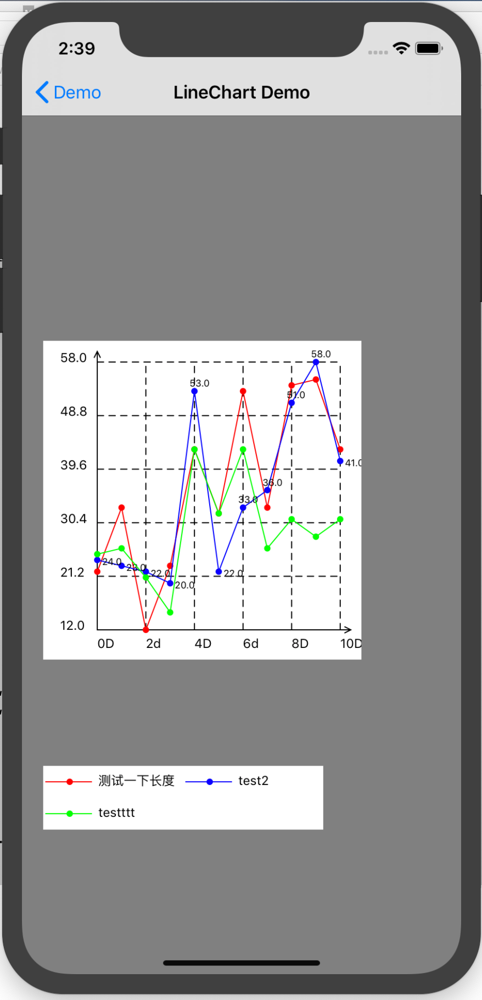

# DBLineChart

轻量版本折线图 in Objective-C。

## Demo演示

1. `git clone https://github.com/DanboDuan/DBLineChart.git `
2. `cd DBLineChart`
3. `pod install`
4. `open Demo.xcworkspace`

## 要求

* iOS 8.0+

## 依赖

* Foundation 
* CoreFoundation 
* CoreText 
* CoreGraphics 
* UIKit

## 使用

1. 直接copy代码，用你的项目prefix重命名文件和类名。
2. pod


```Ruby
pod 'DBLineChart' ,:git => 'https://github.com/DanboDuan/DBLineChart.git',:branch => 'master',:tag => '0.0.1'
```

## 功能

#### DBPlot

**一个DBPlot代表图中一条折线。支持以下配置：**

* `plotTitle`  折线名称，用于`legend View`,不宜太长
* `plotValues` 折线每个节点的Y值，需要考虑溢出，如果是大数值，建议使用`pointLabelFormat`减小数字大小。比如
	- `pointLabelFormat = @"%.1f亿"`
	- `plotValue = 1.12`
	- 即可以表示 `1.12亿`
* `showPointLabel` 是否画出每一个点的数值，比如示例中的蓝色折线
* `pointLabelFormat` 数值展示格式化格式
* `pointLabelColor`	数值展示颜色
* `pointLabelFont`	数值展示字体
* `pointRadius` 折线上的节点的半径
* `pointColor` 折线上的节点颜色，默认同`lineColor`
* `lineColor` 折线颜色
* `lineWidth` 折线宽度

#### DBLineChartView

一个DBLineChartView就是一个折线图，可以添加折线。

**注意**

折线图的Y轴数值和DBPlot的数值是同一单位。如果折线上想用`10000万`而折线图Y轴想用`1亿`，建议通过`yAxisLabelFormat`和`pointLabelFormat`协调，而不能`yAxisValues`设置`1`但是`plotValues`设置`10000`，他们应该设置同样的数字。

**支持属性**

* `axisMarginTop`  折线图最上边虚线以上的高度，避免虚线和顶部挨得太近
* `axisMarginRight` 折线图最右边虚线以外的宽度，避免虚线和右边挨得太近
* `axisMarginBottom` 折线图X轴以下的高度，展示X轴和标签，且避免高度不够
* `axisMarginLeft` 折线图Y轴左边的宽度，展示Y轴和标签，且避免宽度不够
* `axisColor` 坐标轴的颜色，不同于`yGridLineColor`和`xGridLineColor`
* `axisLineWidth` 坐标轴线的宽度
* `legendFontColor` legend View中字体颜色
* `legendFont`	legend View中字体
* `xAxisLabels` X轴标签，有默认值，也可以自定义，
	1. 比如`@[@"0", @"1", @"", @"3"]`通过空字符串跳过`@"2"`,此时xAxisLabels元素个数需要保持和`plotValues`元素个数一样
	2. 如果间隔比如`@[@"0D",@"2d"]`也同样需要和`plotValues`元素个数相对应
	3. `xAxisLabels`是平均间隔分布在X轴上的
* `xAxisLabelFont` X轴标签字体
* `xAxisLabelColor` X轴标签字体颜色
* `yMax` Y轴最大值，默认取折线中最大值
* `yMin` Y轴最小值，默认取折线中最小值
* `yAxisValues` Y轴标签数值，通过`yAxisLabelFormat`控制显示,有默认值，也就是虚线处数值，也可以自定义。
* `yAxisLabelFont` Y轴标签字体
* `yAxisLabelColor` Y轴标签字体颜色
* `showYGridLine` 是否展示Y轴虚线格子，如果数量太多简易不展示
* `showXGridLine` 是否展示X轴虚线格子，如果数量太多简易不展示
* `yGridLineCount` Y轴虚线格子数，默认5
* `xGridLineCount` Y轴虚线格子数，默认和折线节点数一直
* `yGridLineColor` Y轴虚线颜色
* `xGridLineColor` X轴虚线颜色
* `yGridLineWidth` Y轴虚线宽
* `xGridLineWidth` X轴虚线宽
* `plots` 设置`plots`会移除已经添加的折线
* `addPlot:(DBPlot *)plot` 添加折线，不会移除已经添加的
* `drawLineChart` 设置完属性后需要手动调用，来重新绘制折线图
* `(UIView *)legendViewWithRowCount:(NSUInteger)row` 获取示例View,参数`row`控制每一行参数折线示例的个数


**大部分有默认设置的，如果没有特殊要求，可以不需要特意设置。**

## 示例



```Objective-C

DBLineChartView *lineChart = [[DBLineChartView alloc] initWithFrame:CGRectMake(20, 300, 300, 300)];
    self.lineChart = lineChart;
    NSArray* plottingDataValues1 =@[@22, @33, @12, @23,@43, @32,@53, @33, @54,@55, @43];
    NSArray* plottingDataValues2 =@[@24, @23, @22, @20,@53, @22,@33, @36, @51,@58, @41];
    NSArray* plottingDataValues3 =@[@25, @26, @21, @15,@43, @32,@43, @26, @31,@28, @31];
    DBPlot *plot1 = [DBPlot new];
    plot1.plotValues = plottingDataValues1;
    plot1.plotTitle = @"测试一下长度";
    plot1.lineColor = [UIColor redColor];

    DBPlot *plot2 = [DBPlot new];
    plot2.plotTitle = @"test2";
    plot2.plotValues = plottingDataValues2;
    plot2.lineColor = [UIColor blueColor];
    plot2.showPointLabel = YES;

    DBPlot *plot3 = [DBPlot new];
    plot3.plotTitle = @"testttt";
    plot3.plotValues = plottingDataValues3;
    plot3.lineColor = [UIColor greenColor];


    [lineChart addPlot:plot1];
    [lineChart addPlot:plot2];
    [lineChart addPlot:plot3];
    [lineChart setXAxisLabels:@[@"1d",@"2d",@"",@"4d",@"",@"",@"7d",@"",@"",@"",@"11D"]];
    [lineChart setXAxisLabels:@[@"0D",@"2d",@"4D",@"6d",@"8D",@"10D"]];
    lineChart.xGridLineCount = 5;
    [lineChart drawLineChart];

    UIView *legend = [lineChart legendViewWithRowCount:2];
    if (legend) {
        legend.backgroundColor = [UIColor whiteColor];
        legend.frame = CGRectMake(20, 700, legend.bounds.size.width, legend.bounds.size.height);
        [self.view addSubview:legend];
    }
    [self.view addSubview:lineChart];

```

## 证书

本项目使用[MIT 证书](LICENSE)。详细内容参见[证书](LICENSE)文件。


